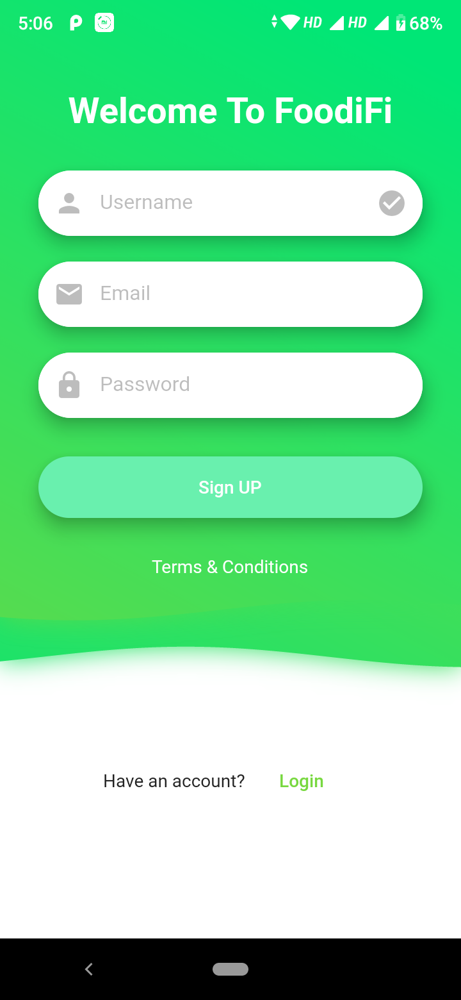
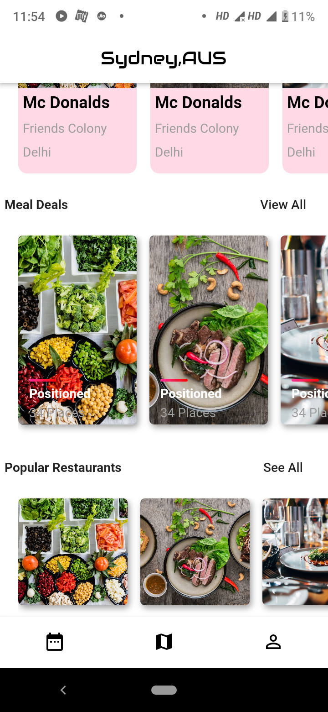

# FoodiFi

   

FoodiFi a Food delivery app.

# Flutter Packages used by the app

```yaml
cupertino_icons:
dio:
sqflite:
connectivity:
rxdart:
flutter_spinkit:
shared_preferences:
cached_network_image:
package_info:
splashscreen:
introduction_screen:
flutter_custom_clippers:
polygon_clipper:
quick_actions:
wave:
firebase_performance:
cloud_firestore:
firebase_auth:
firebase_analytics:
firebase_crashlytics:
google_sign_in:
provider:
# Encrypt libs
args:
asn1lib:
clock:
collection:
crypto:
pointycastle:
```

# Executables

```yaml
executables:
  secure-random:
```

# Dart version

```yaml
sdk: ">=2.2.0 <3.0.0"
```

# App Version & Build Version for Android & iOS

```yaml
version: 1.0.0+1
```

# Running a project

```console
git clone https://github.com/FrazileDevelopers/FoodiFi
flutter run
```

# Build a release apk

```console
git clone https://github.com/FrazileDevelopers/FoodiFi
flutter build apk --release
```

# Screenshots

## Login Screen


## Welcome Screen



## Phone OTP Screen


## Home Page Screen




<!-- # ☕️ Donate
<a href="https://www.buymeacoffee.com/Frazile" target="_blank"></a> -->

# Copyright Claim

Copyright © 2020, [FoodiFi](https://github.com/FrazileDevelopers/FoodiFi).
Released under the [MIT License](LICENSE).
